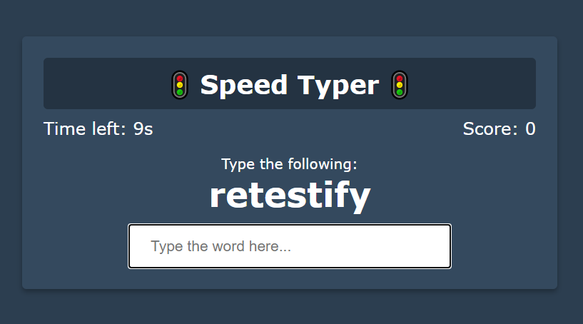
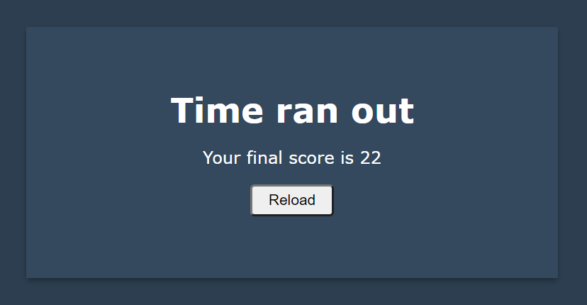
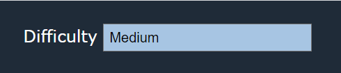
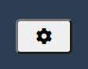

# Typing Game

## Description    
A typing game created using Vanilla JavaScript. Project 12 from Udemy course "20 Web Projects With Vanilla JavaScript" by Brad Traversy.

## Table of Contents

* [Technologies Used](#technologies-used)

* [How to Use](#how-to-use)     

* [How I Made This](#how-i-made-this)  

* [Deployed Application](#link-to-deployed-application)

* [GitHub Repo](#link-to-github-repo)

* [Future Development Ideas](#future-development-ideas)  

## Technologies Used    
Built in Visual Studio with          
HTML       
CSS    
Javascript           

## How to Use      
Navigate to https://alyssahellrung.github.io/typing-game. You will see your first word and the countdown timer will start immediately. If you correctly type your word, a little bit of time will be added to the clock (the amount depends on the difficulty at which you are playing).

  

Try to type as many of the words as possible before time runs out. When time runs out, you will see your score.  

If you finish all 100 words before time runs out, you win! You can adjust the difficulty level in the dropdown menu at the top of the page.  

  

If you want the menu to disappear, click the settings button on the bottom left corner of the page.  

## How I Made This      
I did this project as part of the "20 Web Projects With Vanilla JavaScript" course on Udemy. Once I completed the code-along, I decided to add some features. I added some code that made it so that users would only see each word once. Once that was working, I realized users could, conceivably, exhaust the entire word list, so I decided that would be how users "win" the game and I made a win screen that appears in that case. I also replaced the array of twenty or so words that were used in the code-along with a data file of 100 words that I got from a random word list generator.    

## Link to Deployed Application  
https://alyssahellrung.github.io/typing-game

## Link to GitHub Repo        
https://github.com/alyssahellrung/typing-game  

## Future Development Ideas           
--Incorporate a random word API so the user gets a new word list every time they play.  
--Add sounds for when a user answers correctly and/or wins or loses the game.    